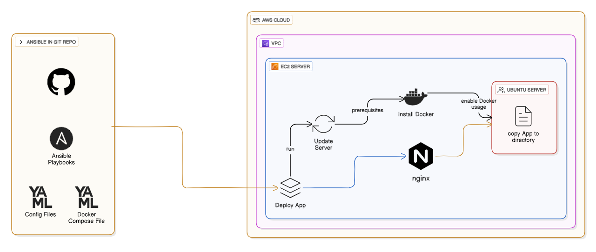

### Part 2: Configuration Management with Ansible!

The Configuration Management phase was to fully automate the setup and configuration of the provisioned EC2 server. This automation ensures that the server environment is standardized, robust, and ready to host the application consistently across deployments.

**Tasks Performed:**

To achieve automated server configuration, the following tasks were executed using Ansible:

1.  **Ansible Playbook Development:**
    An Ansible playbook (`playbook.yml`) was developed to define the desired state of the EC2 instance. This playbook orchestrates a series of tasks to prepare the server and deploy the application.

2.  **Server Preparation:**
    The initial tasks in the Ansible playbook focused on preparing the Ubuntu-based EC2 instance:

    - **Package Updates:** All existing `apt` packages on the server were updated to their latest versions to ensure security and stability.
    - **Python Interpreter:** The `ansible_python_interpreter` variable was explicitly set to `/usr/bin/python3` to ensure Ansible uses the correct Python version on the remote host.

3.  **Docker Installation and Configuration:**
    A crucial part of the configuration was setting up the Docker environment:

    - **Docker Engine Installation:** The `docker.io` package was installed using Ansible's `apt` module.
    - **Docker Service Management:** The Docker service was explicitly started and enabled to automatically launch on system boot using Ansible's `service` module. This guarantees that Docker is always running and available for container operations.
    - **Docker User Group:** The `ubuntu` user (used for SSH access and Ansible execution) was added to the `docker` group. This allows the `ubuntu` user to execute Docker commands without requiring `sudo` privileges, simplifying subsequent application deployment tasks.
    - **Docker Compose Installation:** `docker-compose` (version 1) was installed via `apt`, enabling multi-container application orchestration.

4.  **Application Deployment:**
    After Docker was set up, the application-specific configuration and deployment tasks were performed:
    - **Project Directory Creation:** A dedicated directory (`/opt/network-systemadmin-app`) was created on the EC2 instance to house the application's files, ensuring proper organization and permissions.
    - **File Synchronization:** The entire application context (including `docker-compose.yml`, `nginx/Dockerfile.nginx`, and static content) was securely copied from the GitHub Actions runner to the EC2 instance using Ansible's `synchronize` module (leveraging `rsync`). Exclusions were used to prevent unnecessary files (e.g., `.git/`, `DeployTools/`) from being copied.
    - **Ownership and Permissions:** Correct file ownership (`ubuntu:ubuntu`) and permissions (`0755`) were applied recursively to the application directory to ensure the `ubuntu` user had appropriate access to manage and run the application.
    - **Docker Compose Deployment:** Ansible executed `docker-compose up -d --build --force-recreate` from within the application directory on the EC2 instance. This command:
      - Stops and removes any old Docker Compose services (if they exist).
      - Rebuilds the Docker image for the Nginx service based on the `Dockerfile.nginx`.
      - Starts the Nginx container in detached mode, exposing the web application on port 80.

**Script Locations**

- **Ansible Playbooks:** The `playbook.yml` file, located in `DeployTools/ansible/` within the repository, serves as the primary deliverable. It contains all the tasks detailed above, defining the automated configuration and deployment steps.

- **Explanation of Automation Flow with Ansible:**

  - **Prerequisites:** List any requirements for running the playbook manually (e.g., Ansible installed, SSH key, Python modules like `docker`).
  - **Inventory Setup:** Explain how the inventory (`inventory/host.ini`) is dynamically generated by GitHub Actions, including the need for the VM's public IP and SSH key details.
  - **Playbook Execution:** Provide the command to run the playbook (`ansible-playbook -i inventory/host.ini playbook.yml`).
  - **Ansible Variables:** Explain key variables like `ansible_user`, `ansible_python_interpreter`, and `app_project_dir`.
  - **Flow of Operations:** Detail the sequence of tasks: server updates, Docker installation, user group configuration, file transfer, and Docker Compose application deployment.

  - **Diagram of Deployed Resources:**

  A conceptual diagram of the deployed resources would illustrate:
  
