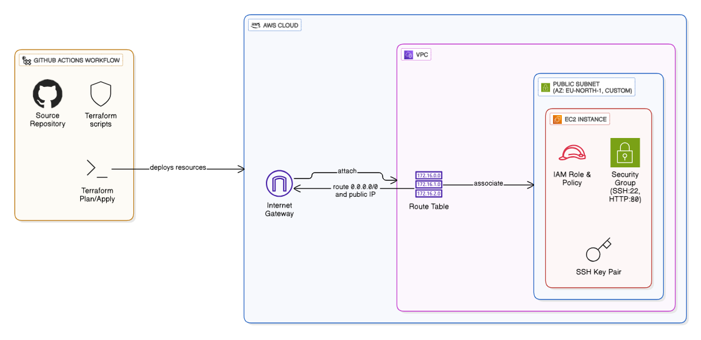

### Infrastructure Setup with Terraform

This phase was to fully automate the provisioning of the cloud infrastructure required to host our server instance. This automation ensures repeatability, consistency, and reduces manual errors, aligning with Infrastructure as Code (IaC) principles.

**Tasks Performed:**

To achieve the infrastructure automation, the following steps were performed:

1.  **Tool Selection and Integration:**

    - **Terraform:** Chosen as the Infrastructure as Code (IaC) tool for defining and provisioning the cloud resources. Terraform's declarative nature allowed for consistent and version-controlled infrastructure definitions.
    - **GitHub Actions:** Utilized as the Continuous Integration/Continuous Deployment (CI/CD) platform to automate the execution of Terraform scripts. This integration enables triggered deployments (e.g., on code pushes to the `main` branch) and provides a robust execution environment.

2.  **Resource Provisioning (AWS EC2 Instance):**
    The Terraform configuration (`./DeployTools/terraform/`) was responsible for provisioning the necessary AWS resources, specifically an EC2 instance, along with its supporting network and security components. Key resources provisioned include:

    - **AWS EC2 Instance:** A virtual server instance (e.g., `t3.micro` running Ubuntu) was provisioned to serve as the host for the Dockerized application.
    - **Security Group:** A dedicated AWS Security Group was created and configured. This security group acts as a virtual firewall, controlling inbound and outbound traffic to the EC2 instance. It was specifically configured to:
      - Allow **inbound SSH access (Port 22)** from anywhre (accessing from GitHub ) to enable secure remote management.
      - Allow **inbound HTTP access (Port 80)** from anywhere (`0.0.0.0/0`) to ensure the web application is publicly accessible.
    - **AWS Key Pair:** An SSH key pair was generated and associated with the EC2 instance, providing secure authentication for SSH connections. The private key portion was securely handled within GitHub Actions secrets.

3.  **Networking Configuration:**
    - The EC2 instance was launched within a default or specified Virtual Private Cloud (VPC) and assigned a public IP address, making it reachable from the internet.
    - The configured Security Group ensured that only the necessary ports (SSH and HTTP) were open to the public internet, adhering to the principle of least privilege for network access as it is a testing senerio.

**Script Location**

- **Terraform Scripts:** The complete Terraform configuration files, typically located in a `DeployTools/terraform/` directory within the project repository, define the AWS infrastructure. These scripts are version-controlled and represent the desired state of the cloud resources. An example structure involves `main.tf` defining the EC2 instance, security groups, and outputs (like the VM's public IP).

- **Diagram of Deployed Resources:**

  A conceptual diagram of the deployed resources would illustrate:
  
